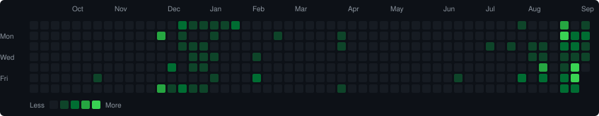

# Hi, I'm Abdulqasem Bakhshi 👋

I'm an incoming **Full Stack Developer** based in Warsaw, Poland.

- Open to project collaborations
- Building modern web applications and improving my full-stack development skills

## 🚀 My Recent Projects

<!-- Add your other projects here -->

## 🛠️ Languages and Tools

## 📈 My GitHub Contributions

  

## 📊 GitHub Stats

  

